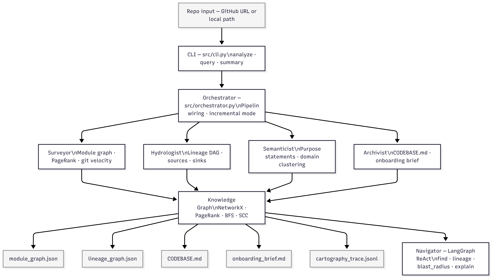

# 🗺️ Brownfield Cartographer

> **Multi-agent codebase intelligence system for rapid FDE onboarding in production environments.**
> Point it at any GitHub repo or local path. Get a living, queryable map of the system's architecture, data flows, and semantic structure — including LLM-generated purpose statements, domain clustering, and the Five FDE Day-One Answers.

---

## Quick Start

```bash
# 1. Clone the repo
git clone https://github.com/Meseretbolled/brownfield-cartographer.git
cd brownfield-cartographer

# 2. Install with uv (locked dependencies)
uv sync
source .venv/bin/activate

# 3. Set up your environment
cp .env.example .env
# Edit .env — add your OpenRouter API key (free at https://openrouter.ai/keys)

# 4. Analyze any GitHub repo (auto-clones)
cartographer analyze https://github.com/dbt-labs/jaffle_shop

# 5. Analyze a local repo
cartographer analyze /path/to/repo

# 6. Interactive query interface (after analysis)
cartographer query /path/to/repo

# 7. Quick summary of existing analysis
cartographer summary /path/to/repo
```

---

## Installation Requirements

- Python 3.11+
- [uv](https://docs.astral.sh/uv/) package manager
- OpenRouter API key (free tier works — get one at https://openrouter.ai/keys)
- git (for velocity analysis)

---

## Commands

### `analyze` — Full pipeline

Runs all four agents: **Surveyor → Hydrologist → Semanticist → Archivist**

```bash
cartographer analyze <repo>

# Options:
#   --output, -o        Custom output directory (default: <repo>/.cartography/)
#   --incremental, -i   Only re-analyse files changed since last run

# Examples:
cartographer analyze /tmp/jaffle_shop
cartographer analyze https://github.com/dbt-labs/jaffle_shop
cartographer analyze https://github.com/mitodl/ol-data-platform
cartographer analyze /tmp/jaffle_shop --output ./my-output
cartographer analyze /tmp/jaffle_shop --incremental
```

### `query` — Interactive Navigator

```bash
cartographer query <repo>
cartographer query <repo> --cartography-dir /path/to/.cartography

# Inside the interactive navigator:
navigator> find <concept>              # Semantic search: "where is revenue logic?"
navigator> lineage <dataset>           # Trace upstream/downstream: "lineage orders"
navigator> lineage <dataset> both      # Both directions
navigator> blast_radius <module>       # What breaks if this changes
navigator> module <path>               # Full module explanation
navigator> sources                     # All data ingestion entry points
navigator> sinks                       # All data output endpoints
navigator> hubs                        # Top modules by PageRank
navigator> ask <question>              # Natural language query (LangGraph agent)
navigator> help                        # Show all commands
navigator> quit                        # Exit
```

### `summary` — Quick summary

```bash
cartographer summary <repo>
```

---

## What It Does

The Cartographer runs four agents in sequence against any codebase:

| Agent | Role | Output |
| --- | --- | --- |
| **Surveyor** | tree-sitter AST analysis — module graph, PageRank, git velocity, dead code detection | `module_graph.json` |
| **Hydrologist** | Data lineage — Python dataflow, SQL (sqlglot), YAML/DAG configs, Jupyter notebooks | `lineage_graph.json` |
| **Semanticist** | LLM purpose statements (batched), doc drift detection, domain clustering, Day-One Q&A | `semanticist_trace.json` |
| **Archivist** | Produces all final artifacts — CODEBASE.md, onboarding brief, audit log | `CODEBASE.md`, `onboarding_brief.md` |

The **Navigator** agent provides interactive querying over the knowledge graph — both structured commands and natural language (via LangGraph ReAct agent).

---

## Generated Artifacts

Every analysis run produces these files in `.cartography/`:

| File | Description |
| --- | --- |
| `module_graph.json` | Full module import graph with PageRank scores, complexity, git velocity |
| `lineage_graph.json` | Data lineage DAG — datasets, transformations, sources, sinks |
| `CODEBASE.md` | **Living context file** — inject into any AI coding agent for instant architectural awareness |
| `onboarding_brief.md` | **Five FDE Day-One questions** answered with evidence citations |
| `semanticist_trace.json` | LLM call log, domain map, drift flags, budget usage |
| `cartography_trace.jsonl` | Audit log of every agent action with confidence levels |
| `analysis_summary.md` | Human-readable run summary |
| `module_graph_networkx.html` | Interactive Pyvis graph visualization |

---

## Web UI

A full web dashboard is available at `http://localhost:8080` after starting the FastAPI server:

```bash
uvicorn main:app --host 0.0.0.0 --port 8080 --reload
```

The dashboard shows:
- **Overview** — architecture summary, hubs table, domain distribution, sources/sinks
- **Surveyor** — interactive Cytoscape.js module dependency graph with inspector panel
- **Hydrologist** — data lineage SVG graph, dataset/transformation tables
- **Semanticist** — module purpose index, domain clusters, drift flags, Day-One FDE answers
- **Archivist** — CODEBASE.md and onboarding_brief.md rendered live
- **Navigator** — all four query tools with interactive results

---

## Architecture

```
brownfield-cartographer/
├── src/
│   ├── cli.py                          # Entry point: analyze, query, summary
│   ├── orchestrator.py                 # Pipeline wiring + incremental mode
│   ├── models/__init__.py              # Pydantic schemas (all node/edge types)
│   ├── graph/knowledge_graph.py        # NetworkX wrapper + PageRank + serialization
│   ├── analyzers/
│   │   ├── tree_sitter_analyzer.py     # Multi-language AST: Python, SQL, YAML, JS
│   │   ├── sql_lineage.py              # sqlglot SQL dependency extraction
│   │   └── dag_config_parser.py        # Airflow/dbt YAML config parsing
│   └── agents/
│       ├── surveyor.py                 # Module graph, PageRank, git velocity, dead code
│       ├── hydrologist.py              # Data lineage graph, blast_radius, sources/sinks
│       ├── semanticist.py              # LLM purpose statements, doc drift, domain clustering
│       ├── archivist.py                # CODEBASE.md, onboarding brief, trace logging
│       └── navigator.py                # LangGraph ReAct agent with 4 tools
├── web/
│   └── index.html                      # Dark-theme dashboard UI
├── main.py                             # FastAPI backend for web UI
├── cartography-artifacts/              # Pre-generated artifacts (3 target repos)
│   ├── jaffle_shop/
│   ├── ol-data-platform/
│   └── data-engineering-zoomcamp/
├── RECONNAISSANCE.md                   # Manual Day-One analysis (ground truth)
├── .env.example
├── pyproject.toml
└── README.md
```

**Four-agent pipeline:**
```
GitHub URL / Local Path
        ↓
   [Surveyor] ──────── tree-sitter AST + git log → module_graph.json
        ↓
  [Hydrologist] ────── sqlglot + regex + YAML → lineage_graph.json
        ↓
  [Semanticist] ────── LLM (OpenRouter) → purpose statements + domain clusters
        ↓
   [Archivist] ──────── synthesises all → CODEBASE.md + onboarding_brief.md
        ↓
   [Navigator] ──────── LangGraph ReAct → find | lineage | blast_radius | explain
```

---
## Architecture



> **Surveyor** (static structure) → **Hydrologist** (data lineage) → **Semanticist** (LLM semantic layer) → **Archivist** (living artifacts). The **Navigator** provides interactive querying over the generated knowledge graph.

## Environment Variables

```dotenv
# OpenRouter — free LLM API (https://openrouter.ai/keys)
OPENROUTER_API_KEY=your-key-here
OPENROUTER_URL=https://openrouter.ai/api/v1

# Models (current working free models as of March 2026)
MODEL_NAME=arcee-ai/trinity-large-preview:free
STRONG_MODEL=arcee-ai/trinity-large-preview:free

# Semanticist tuning
CARTOGRAPHER_DOMAIN_K=6
CARTOGRAPHER_TOKEN_BUDGET=2000000
CARTOGRAPHER_GIT_DAYS=30

# Logging
LOG_LEVEL=INFO
```

> **LLM is optional.** Surveyor + Hydrologist run fully offline with no API key. Semanticist gracefully falls back to path-based heuristics when LLM is unavailable.

---

## Supported Languages & Patterns

| Language | What's Extracted |
| --- | --- |
| **Python** | Imports, functions, classes, pandas/PySpark/SQLAlchemy dataflow, f-string detection |
| **SQL / dbt** | Table dependencies via sqlglot, CTEs, JOINs, `ref()` calls, multi-dialect support |
| **YAML** | Airflow DAG topology, dbt `schema.yml` sources and models, Prefect flows |
| **Jupyter** | `.ipynb` cell source — read/write data references |
| **JavaScript/TypeScript** | Imports, exports via tree-sitter |

---

## Target Codebases Tested

| Repo | Modules | Datasets | Transformations | Sources | Sinks |
|------|---------|----------|-----------------|---------|-------|
| [dbt jaffle_shop](https://github.com/dbt-labs/jaffle_shop) | 8 | 9 | 5 | 4 | 3 |
| [mitodl/ol-data-platform](https://github.com/mitodl/ol-data-platform) | 1106 | 594 | 589 | 348 | 211 |
| [DataTalksClub/data-engineering-zoomcamp](https://github.com/DataTalksClub/data-engineering-zoomcamp) | 127 | 48 | 31 | 25 | 26 |

---

## The Five FDE Day-One Questions

The Cartographer answers these for every repo:

1. **What is the primary data ingestion path?** — Trace from raw sources to first transformation
2. **What are the 3-5 most critical output datasets?** — Terminal sinks in the lineage graph
3. **What is the blast radius if the most critical module fails?** — BFS over dependency graph
4. **Where is the business logic concentrated vs distributed?** — PageRank + domain clustering
5. **What has changed most frequently in the last 30 days?** — Git velocity map

Answers are in `.cartography/onboarding_brief.md` for every analyzed repo.

---

## Key Design Decisions

- **tree-sitter over regex** — structural AST parsing, not string matching
- **sqlglot over regex** — proper SQL dialect support (PostgreSQL, BigQuery, Snowflake, DuckDB)
- **OpenRouter free tier** — no API costs for demo/evaluation
- **Graceful degradation** — every agent logs + skips unparseable files rather than crashing
- **Incremental mode** — `--incremental` re-analyzes only git-changed files
- **LangGraph ReAct** — Navigator uses proper tool-calling agent, not hardcoded dispatch
- **Token budget** — ContextWindowBudget tracks spend and stops LLM calls before exhaustion

---

## Dependencies

Key dependencies (see `pyproject.toml` for full locked list):

- `tree-sitter` — multi-language AST parsing
- `sqlglot` — SQL parsing and lineage extraction  
- `networkx` — graph construction, PageRank, BFS, SCC detection
- `pydantic` — schema validation for all node/edge types
- `typer` + `rich` — CLI and terminal output
- `langgraph` + `langchain-openai` — Navigator ReAct agent
- `fastapi` + `uvicorn` — web UI backend
- `pyvis` — interactive graph visualization